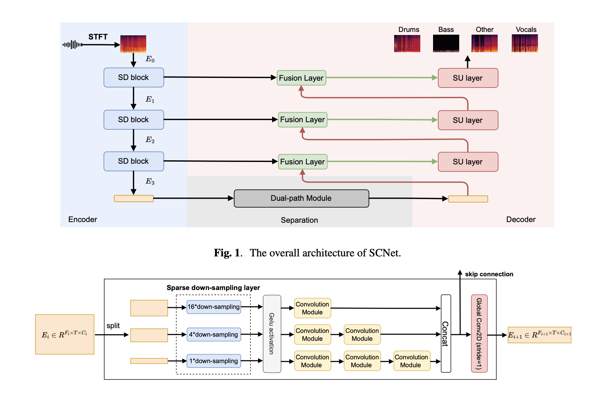

# SCNet-Pytorch

Unofficial PyTorch implementation of the paper 
["SCNet: Sparse Compression Network for Music Source Separation"](https://arxiv.org/abs/2401.13276.pdf).

---
## Table of Contents

1. [Changelog](#changelog)
1. [Dependencies](#dependencies)
2. [Inference](#inference)
3. [Train](#train)
4. [Repository structure](#structure)
5. [Citing](#cite)

---
<a name="changelog"/>

# Changelog

- **10.02.2024**
  - Model itself is finished. The train script is on its way.
- **21.02.2024**
  - Add part of the training pipeline.

---

